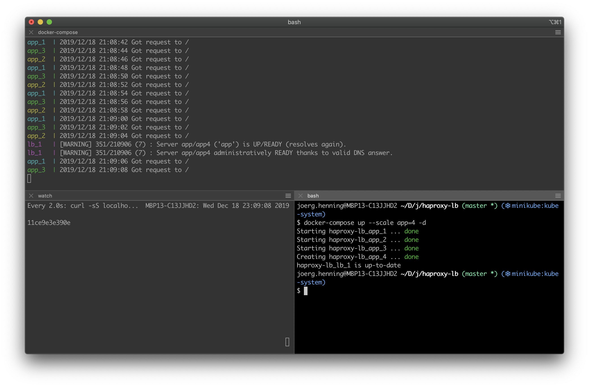
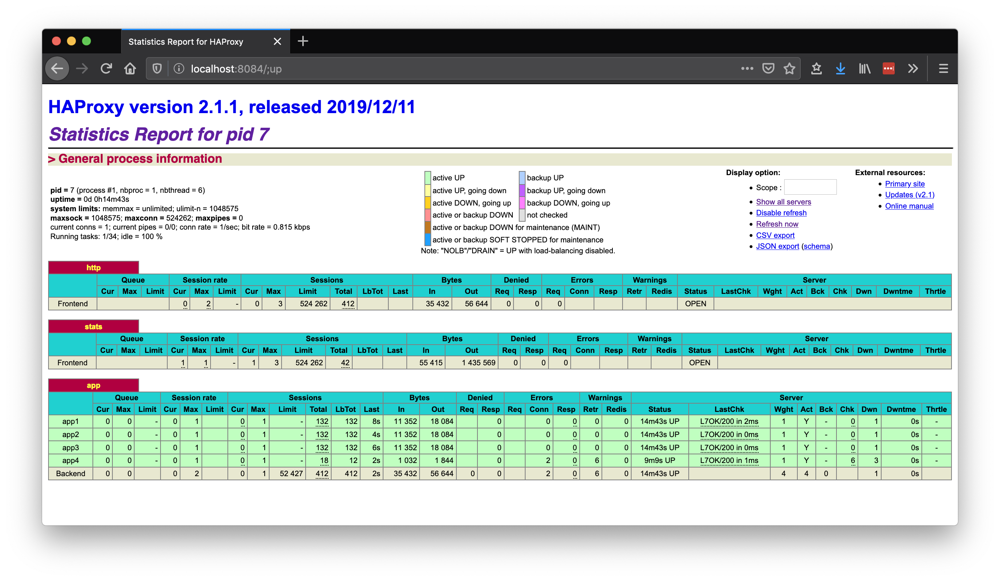

# HAProxy & Docker Load Balancer Demo

Docker compose with app backend and HAProxy as simple proxy/load balancer.

See https://cbonte.github.io/haproxy-dconv/2.1/configuration.html

## Usage

Start app with 3 backends:

```sh
docker-compose up --scale app=3
```

Open a new terminal and periodically send requests. Observe how each request is handled by a different backend:

```sh
watch curl -sS localhost:8080
```

Scale up, the new instances will be receiving requests on the fly. Due to some limitations in HAProxy's config, we need to provide a fixed range of servers. The config here supports up to 10 backends.

```sh
$ docker-compose up --scale app=5 -d
```

Scale down - might result in requests getting lost before HAProxy detects the servers being n/a. Possible solution would be to use the runtime API instead of DNS service resolution. 

```sh
$ docker-compose up --scale app=3 -d
```



## Stats

Check the stats page at http://localhost:8084



## Resources

- [HAProxy 2.1 manual](https://cbonte.github.io/haproxy-dconv/2.1/configuration.html )
- [Service discovery with DNS](https://www.haproxy.com/blog/dns-service-discovery-haproxy/)
- [Dynamic configuration](https://www.haproxy.com/blog/dynamic-scaling-for-microservices-with-runtime-api/)
